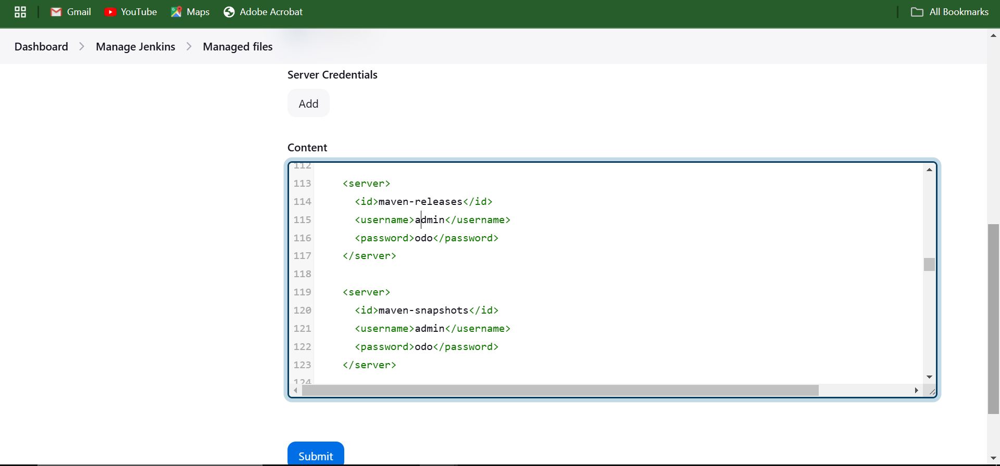

# CI Pipeline Setup Guide with Jenkins for Multi-Tier-GitOps-Project

This guide will walk you through setting up the Jenkins pipeline from scratch, including initial Jenkins setup, plugin installation, and configuration for the CI pipeline. The pipeline will automate code compilation, testing, security scans, code coverage scans, artifact publishing, Docker image management, and Email notification.

---

## Prerequisites

- **Jenkins Server**: - The EC2 server setup running Jenkins, with Java, Docker, and Trivy installed and accessible over the browser. **See [Infra-Setup](./Infra-Setup) for guidance** 
- **Docker**: Docker installed on the Jenkins server for building and pushing images.
- **Java**: JDK 17 is required to compile and run your Java application.
- **Maven**: Required for dependency management and building the application.
- **SonarQube**: A SonarQube server is needed for code quality analysis.
- **Git**: Git installed on Jenkins for cloning repositories.
- **Network Access**: Jenkins should have access to Docker Hub and any other external services you plan to use (SonarQube, GitHub, etc.).

---

## Accessing Jenkins and Initial Setup

### 1. Start Jenkins and Access the Web Interface
1. Launch Jenkins on your server or local environment.
2. Open a browser and navigate to `http://<your_server_ip>:8080`.
3. You’ll be prompted to enter the Jenkins initial admin password.

### 2. Retrieve the Initial Admin Password
To get the initial password for Jenkins running in a Docker container, use the command:
```bash
sudo cat /var/jenkins_home/secrets/initialAdminPassword
```
Copy the password and paste it into Jenkins to proceed with the setup.

### 3. Install Plugins:- `Recommended Plugins`
After logging in, Jenkins will prompt you to install plugins. Choose `Install Suggested Plugins` to install common plugins.

#### Additional Required Plugins
To install project-specific plugins:
1. Go to **Manage Jenkins** > **Manage Plugins**.
2. Under the **Available** tab, search for and install these plugins:
   - Docker Pipeline
   - Docker
   - Eclipse Temurin Installer
   - SonarQube Scanner
   - Config File Provider
   - Maven Integration
   - Pipeline Maven Integration
   - Pipeline: Stage View

---

### 4. Configuring Global Tool Installations
1. **Java (JDK)**:

- Go to Manage Jenkins > Global Tool Configuration.
- Under `JDK installations`, click `Add JDK` and select `Install automatically`.
- Set the Name to `jdk17`.
- Click `Add Installer` and Select `Install from adoptium.net`from the installation options.
- Scrol to `OpenJDK 17 - HotSpot` under `Version` and choose your preferred version within the top 5 versions of the `OpenJDK 17 - HotSpot`, I chose this version `jdk-17.0.11+9`.
 
2. **Maven**:

- Under `Maven installations`, click Add Maven.
- Set the Name to `maven3` and select Install automatically.

3. **SonarQube Scanner**:

- Under `SonarQube Scanner installations`, click `Add SonarQube Scanner`.
- Set the Name to `sonar-scanner` and select Install automatically.

4. **Docker**:

- Under `Docker installations`, click `Add docker`.
- Set the Name to `docker` and select Install automatically.
- click `Add Installer` and select `Download from docker.com`.
- Docker version should be `latest`

5. **After entering the tools configuration details, click `Apply` and `Save` to close the configuration page**


---

### 5. Configure your Credentials
- Go to `**Dashboard**` > `**Manage Jenkins**` > `**Credentials**`
- Click on `**(global)**` > `**Add Credentials**` > select `**Kind**` 

    #### Types of Kind to choose for the Credentials
    - For Git Credentials (git-cred) ---> Username with password
    - For SonarQube PAT (sonar-token) ---> Secret text
    - For Docker Credentials (docker-cred) ---> Username with password
    - For Email Credentials (email-cred) ---> Username with password 

- For each `kind` you select provide the credential key details like the `**ID**`, `**Name**` and `**Description**` then proceed to create your Credentials. **[SEE SCREENSHOT IMAGES IN THE SCREENSHOT SECTION](#screenshots)** 


#### Creating Credentials in Jenkins

To securely store credentials in Jenkins, follow these steps for each type of credential required by the pipeline.

##### 1. Git Credentials (`git-cred`) - Username with Password

1. Go to **Dashboard** > **Manage Jenkins** > **Manage Credentials**.
2. Select the appropriate domain **(global)**
3. Click **Add Credentials**.
4. In the **Kind** dropdown, select **Username with password**.
5. Fill in the following fields:
   - **Username**: Enter your Git username.
   - **Password**: Enter your Git password or personal access token.
   - **ID**: Enter `git-cred` (The ID I used in my pipeline).
   - **Description**: Provide a description for easy identification (e.g., "Git Credentials for Pipeline").
6. Click **OK** to save the credential.

##### 2. SonarQube PAT (`sonar-token`) - Secret Text

1. Go to **Dashboard** > **Manage Jenkins** > **Manage Credentials**.
2. Select the appropriate domain  **(global)**
3. Click **Add Credentials**.
4. In the **Kind** dropdown, select **Secret text**.
5. Fill in the following fields:
   - **Secret**: Paste the SonarQube Personal Access Token (PAT) here.
   - **ID**: Enter `sonar-token` (The ID I used in my pipeline).
   - **Description**: Provide a description (e.g., "SonarQube Token for Code Analysis").
6. Click **OK** to save the credential.

##### 3. Docker Credentials (`docker-cred`) - Username with Password

1. Go to **Dashboard** > **Manage Jenkins** > **Manage Credentials**.
2. Select **(global)**) 
3. Click **Add Credentials**.
4. In the **Kind** dropdown, select **Username with password**.
5. Fill in the following fields:
   - **Username**: Enter your Docker Hub username.
   - **Password**: Enter your Docker Hub password or access token.
   - **ID**: Enter `docker-cred` (The ID I used in my pipeline).
   - **Description**: Provide a description (e.g., "Docker Credentials for Pipeline").
6. Click **OK** to save the credential.

##### 4. Email Credentials (`email-cred`) - Username with Password

1. Go to **Dashboard** > **Manage Jenkins** > **Manage Credentials**.
2. Select the appropriate domain **(global)**
3. Click **Add Credentials**.
4. In the **Kind** dropdown, select **Username with password**.
5. Fill in the following fields:
   - **Username**: Enter your email service Email address.
   - **Password**: Enter your email service `**app passwords**`.
   - **ID**: Enter `email-cred` (The ID I used in my pipeline).
   - **Description**: Provide a description (e.g., "Email Credentials for Jenkins Notifications").
6. Click **OK** to save the credential.

**NOTE**:
You are expected to generate google app passwords for the GMAIL Email Notification. This app password is what you are expected to use to create Email credentials and not your real Email password. Here is how to generate one: 
- Go to `https://myaccount.google.com/apppasswords`
- Provide an `App Name` which can be any name and click `Create` to generate app password.
- Copy app password and use it to create your Email credential (email-cred), also use it as password for E-mail Notification.

This completes the credential setup in Jenkins for Git, SonarQube, Docker, and Email. Each credential ID will be referenced in the pipeline stages as needed.

---

### 6. Config File Management
- Go to `**Dashboard**` > `**Manage Jenkins**` > `**Managed files**`
- Click on `Add a new config` and select `Global Maven settings.xml`
- Scroll down to the buttom of the page and find `ID` ID of the config file.
- Clear the content of the `ID` and enter `maven-settings`, then click `Next`
- scroll down to `**Server Credentials**` > `**Content**` then scroll the `content` box to find `servers` section.
- Uncomment the server section in the content box and add your Nexus  server credential details: 

```bash
<server>
      <id>maven-releases</id>
      <username>admin</username>
      <password>odo</password>
    </server>
    
    <server>
      <id>maven-snapshots</id>
      <username>admin</username>
      <password>odo</password>
    </server>
```

#### NOTE
In this step, we set up a global Maven settings.xml file to manage credentials securely for our Maven repository (e.g., Nexus). By defining this configuration in Jenkins, we ensure that the pipeline can access the repository with appropriate credentials without hard-coding sensitive information into the pipeline script. This also allows centralized management of configuration files, making it easier to update and maintain. Additionally, by specifying credentials under Server Credentials, we can manage multiple environments (such as maven-releases and maven-snapshots) and ensure the correct permissions are applied when Jenkins interacts with these repositories. **[SEE SCREENSHOT IMAGES IN THE SCREENSHOT SECTION](#screenshoots)**

- **Update the `Distribution Management Configuration` in the `pom.xml` file**.
  
    - Ensure to add your Nexus server `public Ip` here `http://<nexus-server-pulic-ip>:8081` in the `Distribution Management Configuration` section of the `pom.xml` file as shown:
      ```bash
       <!-- Configuration to Deploy both snapshot and releases to Nexus -->
       <distributionManagement>
           <repository>
               <id>maven-releases</id>
               <name>maven-releases</name>
               <url>http://<nexus-server-pulic-ip>:8081/repository/maven-releases/</url>
           </repository>
           <snapshotRepository>
               <id>maven-snapshots</id>
               <name>maven-snapshots</name>
               <url>http://<nexus-server-pulic-ip>:8081/repository/maven-snapshots/</url>
           </snapshotRepository>
       </distributionManagement>
      ```

---

### 7. Configure SonarQube servers

- Go to `**Dashboard**` > `**Manage Jenkins**` > `**System**` > `**SonarQube servers**`
- Click `Add SonarQube` and provide the following: 
    - Name as:  `sonar-server`
    - Server URL with your SonarQube server URL: `http://<Public-IP>:9000`
    - Server authentication token: Your Generated SonarQube PAT and added as a credential in my case `sonar token.`


#### How to Generate SonarQube Personal Access Token (PAT) from your SonarQube Server:
- While logged-in in your SonarQube server, locate and click `**Administration**` at the top of the page.
- Under the `**Administration**` page, select `**Security**` > `**Users**` > `**Tokens**` to generate token.
- Click the box under the `Tokens` section to generate token.
- Enter token name in my case: `sonar-token`, generate and copy the token to a safe place.
- Create a credential following the steps mentioned in the credentials section above to create the SonaQube Server authentication token afterwards, you will add the generated PAT as a secret text. **[SEE SCREENSHOT IMAGES IN THE SCREENSHOT SECTION](#screenshots)** 


---

### 8. Configure Email Notification and Extended E-mail Notification 

- Go to `**Dashboard**` > `**Manage Jenkins**` > `**System**` > Find `**Extended E-mail Notification**` and `**Email Notification**` 
- Fill in the Forms as shown in the screenshoots below to configure both `**Extended E-mail Notification**` and `**Email Notification**`. 

#### Extended E-mail Notification and E-mail Notification configuration

##### Extended E-mail Notification configuration


##### E-mail Notification configuration


- After setting up `E-mail Notification` click the button below `**Test configuration by sending test e-mail**`

##### NOTE:
You are expected to generate google app passwords for the GMAIL Email Notification. This app password is what you are expected to use to create Email credentials and not your real Email password. Here is how to generate one: 
- Go to `https://myaccount.google.com/apppasswords`
- Provide an `App Name` which can be any name and click `Create` to generate app password.
- Copy app password and use it to create your Email credential (email-cred), also use it as password for E-mail Notification.

---

## Setting Up the Jenkins Pipeline

### 1. Create a New Pipeline
1. From the Jenkins dashboard, click on **New Item**.
2. Enter a name for your pipeline `BankApp-CI` and select **Pipeline**. Click **OK**. 

### 2. Configure the Pipeline Script 
1. In the pipeline configuration page, scroll to **Discard old builds**, select the number of **Days to keep builds**, also enter the `2` or any number you like for the **Max # of builds to keep**.
2. In the pipeline configuration page, scroll to the **Pipeline** section.
3. Choose **Pipeline script** and enter the Jenkinsfile script in the **[Jenkinsfile](./Jenkins-CI/Jenkinsfile)** in the folder.


### 3. Pipeline Stages and Explanation

The pipeline contains the following stages:

- **Clear Workspace** - Removes existing files in the workspace to ensure a clean environment.
- **Git Checkout** - Clones the project’s code repository to the workspace.
- **Code Compile** - Compiles the source code to ensure it is executable.
- **Test** - Runs unit tests to validate code functionality and catch errors.
- **Trivy FS Scan** - Scans the file system for security vulnerabilities and outputs result in a html format.
- **SonarQube Analysis** - Analyzes code quality, code coverage, maintainability, and technical debt using SonarQube.
- **Build** - Packages the application into an artifact for deployment.
- **Publish Artifacts** - Publishes built artifacts to a Maven repository for version control.
- **Docker Build and Tag** - Builds a Docker image and tags it with a version for deployment.
- **Docker Image Scan by Trivy** - Scans the Docker image for any security vulnerabilities.
- **Publish Docker Image to DockerHub Repository** - Pushes the tagged Docker image to DockerHub.
- **Update Docker Tag in the Manifest File** - Updates the Kubernetes deployment manifest with the latest image tag in the `manifest` branch.
- **E-mail Notification** - Sends out Email notification for successful or failed builds.


### 4. Pipeline Stage Code Generation using Pipeline Syntax

To generate code for each pipeline stage in Jenkins, use the **Pipeline Syntax** tool. This tool provides a user-friendly interface to create pipeline snippets for various steps, which you can then copy and paste into your pipeline script.

Follow these steps to generate the code for each stage:

1. **Access Pipeline Syntax**:
   - In Jenkins, navigate to your pipeline project.
   - Click on **Pipeline Syntax** in the left-hand menu.

2. **Select Step Type**:
   - In the **Sample Step** dropdown, choose the type of action you want to perform in the pipeline stage (e.g., `git:Git` for cloning a repository, `sh` for shell commands, `withMaven` for Maven steps, withSonarQubeEnv for SonarQube Server, etc.).

3. **Configure Parameters**:
   - Fill in the required fields for the chosen step, such as repository URL for `git`, command for `sh`, or other options specific to the step.

4. **Generate Pipeline Script**:
   - Once all fields are filled, click **Generate Pipeline Script**.
   - Copy the generated code and insert it into your pipeline script at the appropriate stage.

Repeat these steps for each stage in your pipeline to quickly build the code structure for all actions. This approach ensures accuracy and simplifies the creation of complex Jenkins pipeline configurations.

---

## Steps to Run the Jenkins Pipeline

To execute the pipeline in Jenkins, follow these streamlined steps:

1. **Verify Setup and Configuration**
   - Ensure all plugins are installed and configured appropriately following the guide above.
   - Check that credentials (`git-cred`, `sonar-token`, `docker-cred`, `email-cred`) are configured.

2. **Trigger the Pipeline**
   - To start the pipeline, go to the `BankApp-CI`job page and click **Build with Parameters**.
   - Select your preferred `**DOCKER_TAG**`and click `**Build**`

3. **Monitor Execution**
   - Select the running build to view **Console Output** for real-time logs.
   
4. **Verify Key Stages**
   - Each stage should execute sequentially; confirm that core stages complete without errors:
     - `Clear Workspace`, `Git Checkout`, `Code Compile`, `Test`
     - `Trivy FS Scan`, `SonarQube Analysis`, `Build`, `Publish Artifacts`
     - `Docker Build and Tag`, `Docker Image Scan`, `Publish Docker Image`
     - `Update Docker Tag in the Deployment manifest file in manifest branch`, and `Email Notification Code Block`

5. **Review Notifications**
   - The pipeline sends an email with the build status. Verify that notifications are correctly set up for alerts on build status.
   
---

## Screenshots 

### project-credentials


### SonarQube Server Personal Access token (PAT)


### Pipeline Trigger


### Managed Files For Nexus Server



