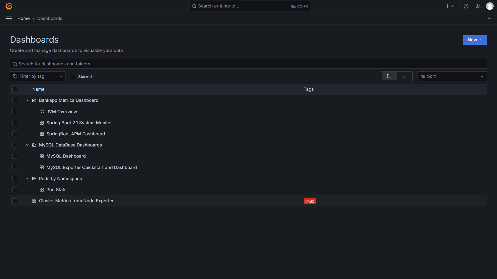
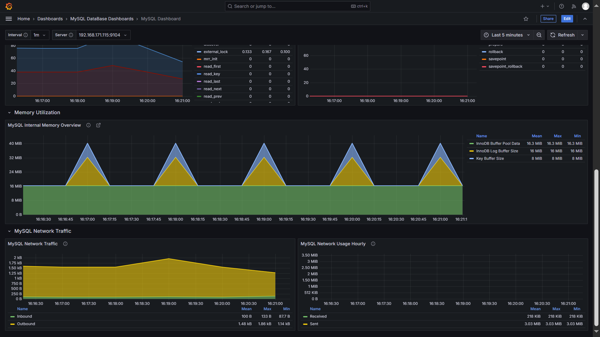

# Grafana Visualization Setup for Monitoring Metrics

This guide provides a step-by-step walkthrough to configure **Grafana** for visualizing metrics scraped by **Prometheus** as part of the monitoring setup. Building on the foundation laid previously in setting up monitoring infrastructure **[Prometheus](../README.md)** and **[Alertmanager](../Alertmanager-setup/README.md)**, this guide covers the dashboard setup, folder organization, and visualization of key metrics.

## Prerequisites

1. **Prometheus and Alertmanager** must be running in your Kubernetes cluster as per the monitoring setup detailed in **[Monitoring Setup](../README.md)**.
2. Grafana must be deployed in your cluster. If Grafana is not deployed, follow the deployment steps below.

---

## Step 1: Deploy Grafana

### 1.1 Add the Grafana Helm Repository
```bash
helm repo add grafana https://grafana.github.io/helm-charts
helm repo update
```

### 1.2 Install Grafana using Helm
```bash
helm install grafana grafana/grafana --namespace monitoring 
```

> **Verify the Installation**:
```bash
kubectl get pods -n monitoring
```

### 1.3 Access Grafana
- Retrieve the Grafana admin password:
  ```bash
  kubectl get secret --namespace monitoring grafana -o jsonpath="{.data.admin-password}" | base64 --decode ; echo
  ```
- Access Grafana through the service:
  ```bash
  kubectl port-forward svc/grafana 3000:80 -n monitoring
  ```
  Visit `http://<SERVER-IP>:3000` in your browser.

> **NOTE**: By default, **Grafana** will be exposed via a ClusterIP service. To expose it as a LoadBalancer, use the following commands:

  ```bash
  kubectl patch service grafana -n monitoring -p '{"spec": {"type": "LoadBalancer"}}'
  ```
  
  **Get the External IP or DNS Name of the LoadBalancer**:
  ```bash
  kubectl get service -n monitoring grafana
  ```
  
  **Access grafana in your browser at**:
  ```bash
  http://<EXTERNAL-IP>:3000   # or http://<DNS-NAME>:3000
  ```
---

## Step 2: Configure Data Source in Grafana

1. Log in to the Grafana dashboard using the default credentials (`admin/<admin password>` or as set during installation).
2. Navigate to **connections** > **Data Sources**.
3. Click **Add data source** and select **Prometheus**.
4. Name your data source if you like in the `Name` section e.g `Bankapp-Prometheus-Datasource`.
5. Enter the Prometheus server URL (default: `http://prometheus-server.monitoring.svc.cluster.local:9090`) and click **Save & Test**.

---

## Step 3: Import Dashboards

Grafana allows importing pre-configured dashboards to quickly visualize key metrics. Below are the dashboards used in this setup.

| **Dashboard Name**               | **ID**   | **Description**                                                                                   |
|-----------------------------------|----------|---------------------------------------------------------------------------------------------------|
| MySQL Overview                   | `7362`   | Provides insights into MySQL database metrics like queries, connections, and performance.         |
| MySQL Exporter Quickstart        | `14057`  | A comprehensive MySQL exporter dashboard for monitoring database health and performance.          |
| Node Exporter Full               | `1860`   | Detailed system metrics like CPU, memory, disk, and network from Node Exporter.                  |
| JVM Overview                     | `15104`  | Java Virtual Machine (JVM) metrics including heap usage, garbage collection, and thread stats.    |

### Steps to Import Dashboards

1. Navigate to **Dashboards** > **New** > **Import**.
2. Enter the dashboard **ID** (e.g., `7362` for MySQL Overview) and click **Load**.
3. Select the Prometheus data source configured earlier.
4. Click **Import**.

Repeat these steps for each dashboard.

---

## Step 4: Create Custom Dashboards

In this step, we'll create a custom dashboard titled **Pod Stats**, organized under the folder **Pods by Namespace**. This dashboard will include multiple panels, each configured with specific queries and visualizations to represent cluster pod metrics in all Namespaces (Pods running in all the Namespaces). Follow the detailed guide below to replicate the setup and achieve the appearance shown in the reference image.

---

### Panel 1: **Memory Usage Percentage of the Nodes**

1. **Add a New Panel:**
   - Click on **Add panel** and select **Stat** as the visualization type.
2. **Enter the Query then click `Run Queries`:**
   ```promql
   100 * (1 - ((avg_over_time(node_memory_MemFree_bytes[10m]) + avg_over_time(node_memory_Cached_bytes[10m]) + avg_over_time(node_memory_Buffers_bytes[10m])) / avg_over_time(node_memory_MemTotal_bytes[10m])))
   ```
3. **Panel Configuration:**
   - **Panel Title**: Memory Usage Percentage of the Nodes
   - **Value options**: calculate
   - **Unit**: Percentage (%)
   - **Thresholds**:
     - Add green, yellow, and red thresholds to visually indicate memory usage levels.
   - **Stat Display**: Show both the current value and the percentage change trend.

4. **Save Panel**: Once configured, click Apply to save the panel.
   - **Panel 1 Configuration:**  
     
     *Panel Configuration for `Memory usage Percentage of the Nodes`*

---
### Panel 2: **Total Number of Pods Running by Namespace**

1. **Add a New Panel:**
   - Click on Add panel and select **Time series** as the visualization type.

2. **Enter the Query then click `Run Queries`:**
   ```promql
   count(kube_pod_status_phase{phase=~"Running"}) by (namespace)
   ```

3. **Panel Configuration:**
   - **Panel Title:** Total Number of Pods Running by Namespace
   - **Legend:** Enable and set it to show the namespace names with `mode`as `list`.
   - **Standard options:** `Unit` enter `Pods`
   - **Visualization Settings:**
     - Use lines for data representation.
     - Adjust the line width for clarity.
     - **Enable tooltips for on-hover metric details:** This is a default feature.

4. **Save Panel:** Once completed, click Apply to save the panel.
   - **Panel 2 Configuration:**  
     
     *Panel Configuration for `Total Number of Pods Running by Namespace`*

---
### Panel 3: **Number of Pods Running in Cluster by Namespace**
1. **Add a New Panel:**
   - Click on Add panel and select `Pie chart` as the visualization type.

2. **Enter the Query then click `Run Queries`:**
   ```promql
   sum(kube_pod_status_phase) by (namespace)
   ```

3. **Panel Configuration:**
   - **Panel Title:** No of Pods Running in Cluster by Namespace
   - **Legend:** Turn `Visibility` on
   - **Legend values:** `value`  
   - **Pie Chart Settings:**
     - Set the chart to `donut mode` for better visualization.
     - Enable labels to display the namespace and value.
     - Customize the color palette to distinguish namespaces.
4. **Save Panel**: Click Apply to save the panel.
   - **Panel 3 Configuration:**  
     
     *Panel Configuration for Number of Pods Running in Cluster by Namespace*

---

## Step 5: Organize Dashboards into Folders

To keep dashboards organized, group them into folders:

1. Navigate to **Dashboards**.
2. Click **New** > **Folder**.
3. Create folders with meaningful names (e.g., `MySQL Database Dashboards`, `Pods by Namespace`, etc.).
4. Move dashboards into the respective folders by selecting them and using the **Move** option.

> **Folder Structure Example**:
- **Bankapp Metrics Dashboard**
  - JVM Overview
- **MySQL Database Dashboards**
  - MySQL Dashboard
  - MySQL Exporter Quickstart and Dashboard
- **Pods by Namespace**
  - Pod Stats
  - Cluster Metrics from Node Exporter

  - **Organization of Dashboards Into Folders**  
     
     *Organize your Dashboards into folders as shown*
---

## Step 6: Dashboard Views

### 1. JVM Overview dashboards
  
  - **JVM Overview Dashboard for Monitoring the `Bankapp` Custom Metrics**  
     
     
     
          

### 2 MySQL Database Dashboards

  - **MySQL Overview Dashboards for Monitoring the `MySQL` database Metrics**  
     
     


  - **MySQL Exporter Quickstart Dashboards for Monitoring the `MySQL` database Metrics**  
     
     


### 3. Node Exporter Full Dashboard 
  
  - **Node Exporter Full Dashboard for Monitoring the entire cluster Metrics**  
     
     
     


### 4. Custom Dashboard View

  - **Custom Dashboard for Monitoring the Pods running in all Namespaces in the cluster**  
     


---

## Step 7: Set Up Alerts (Optional)

1. Navigate to **Alerting** > **Contact points** and configure notification channels (e.g., Slack, Email).
2. Define alert rules based on metrics thresholds for proactive monitoring.

---

## Conclusion

Your Grafana setup for visualizing metrics is now complete! With pre-configured and custom dashboards, you can monitor your infrastructure and applications efficiently. Regularly update and maintain dashboards to ensure they reflect current monitoring needs.

---

## Resources
- [Grafana Documentation](https://grafana.com/docs/)
- [Prometheus Documentation](https://prometheus.io/docs/)

---

