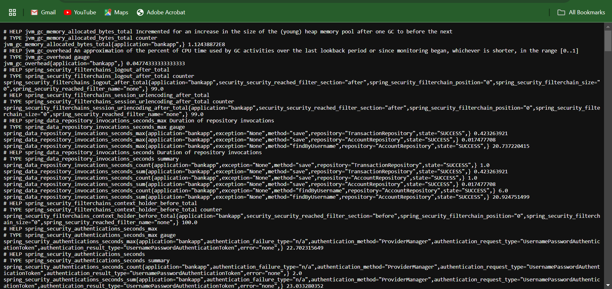
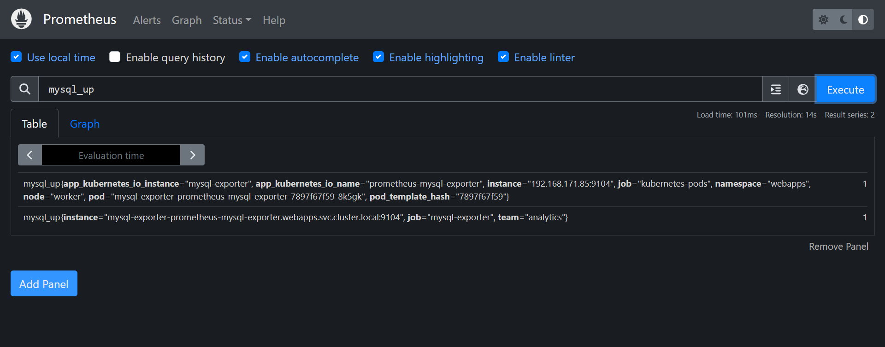

# Setting Up Custom Monitoring Metrics for BankApp Using Prometheus, Alertmanager, and Grafana

This guide walks you through the steps to set up the custom monitoring metrics for the `BankApp` application using `Prometheus`, `Alertmanager`, and `Grafana`. Before proceeding with the setup, ensure the necessary prerequisites are implemented in the application code.

## Prerequisites

To enable custom monitoring metrics in the application, specific modifications need to be made to the application code. Below are the required steps and configurations:

### 1. Add Dependencies
Added necessary dependencies for Micrometer and Prometheus. As a Spring Boot application, I added the following dependencies to the `pom.xml` file:

```xml
<dependency>
    <groupId>io.micrometer</groupId>
    <artifactId>micrometer-core</artifactId>
</dependency>
<dependency>
    <groupId>io.micrometer</groupId>
    <artifactId>micrometer-registry-prometheus</artifactId>
    <version>1.10.5</version>
</dependency>
```

### 2. Annotate Methods with `@Timed`
Used the `@Timed` annotation to measure the execution time of specific methods or endpoints in the application. This automatically generates metrics for these methods.

#### Example
In the the application's **[src/main/java/com/example/bankapp/controller/BankController.java](https://github.com/Godfrey22152/Multi-Tier-GitOps-Project/blob/main/src/main/java/com/example/bankapp/controller/BankController.java)**, `@Timed`is used to annotate methods like this:

```java
@Timed(value = "bankapp.dashboard", description = "Time taken to display the dashboard")
@GetMapping("/dashboard")
public String dashboard(Model model) {
    String username = SecurityContextHolder.getContext().getAuthentication().getName();
    Account account = accountService.findAccountByUsername(username);
    model.addAttribute("account", account);
    return "dashboard";
}
```

This creates a Prometheus metric named `bankapp_dashboard` with timing data for the `dashboard` method. This was also repeated for other critical methods which was used to to monitor performance, such as `registerAccount`, `deposit`, `withdraw`, and more.

### 3. Create a Metrics Configuration Class
To enable the use of the `@Timed` annotation and configure Prometheus metrics, I created a configuration class. take a look at the **[src/main/java/com/example/bankapp/MetricsConfig.java](https://github.com/Godfrey22152/Multi-Tier-GitOps-Project/blob/main/src/main/java/com/example/bankapp/MetricsConfig.java)** class.

### 4. Enable Prometheus Endpoint
In the **[application.properties](https://github.com/Godfrey22152/Multi-Tier-GitOps-Project/blob/main/src/main/resources/application.properties)** file, I enabled the Prometheus metrics endpoint. This is typically part of the Spring Boot Actuator. This configuration ensures that the Spring Boot application exposes metrics in a format that Prometheus can scrape and use. 

#### Configuration:
```properties
management.endpoints.web.exposure.include=*  
management.endpoint.prometheus.enabled=true
management.metrics.export.prometheus.enabled=true
management.metrics.enable.custom=true

```
Here's a brief explanation of each property and why it's needed:
- 1. `management.endpoints.web.exposure.include=*`: This enables all actuator endpoints, including the `/actuator/prometheus` endpoint. The Prometheus endpoint is necessary for exposing metrics to Prometheus.
- 2. `management.endpoint.prometheus.enabled=true`: Explicitly enables the Prometheus endpoint. Without this setting, even if the actuator is enabled, the Prometheus-specific endpoint might not work.
- 3. `management.metrics.export.prometheus.enabled=true`: Enables the Prometheus metrics exporter in Micrometer. This is the library that bridges Spring Boot metrics with Prometheus.
- 4. `management.metrics.enable.custom=true`: Ensures that custom metrics (such as those annotated with @Timed in your code) are enabled. This allows Prometheus to collect your specific application-level metrics in addition to default system and JVM metrics.

### 5. Verify the Prometheus Metrics
When the `BankApp` application is deployed, navigate to the `/actuator/prometheus` endpoint (e.g., `http://<APP-EXTERNAL-IP>:<PORT>/actuator/prometheus`) to confirm that the metrics are being exposed. You should see metrics such as `bankapp_dashboard_seconds_count`, `bankapp_dashboard_seconds_sum`, and others.

- **Prometheus Endpoint Metrics**
  
  *This image shows the Prometheus endpoint metrics including BankApp application metrics endpoint in the `/actuator/prometheus` metrics_path. This exposes the metrics to Prometheus for scraping.*

---

## Infrastructure setup

Verify Helm Installation in your `EKS cluster`:

```bash
helm version
```
You should see Helm’s version details if installed correctly if not installed kindly install it.

### Configuring Helm for Amazon EKS
Helm requires access to the Kubernetes API server to manage resources within your EKS cluster.

1. Set up RBAC for Helm (Helm 3):

In Amazon EKS, you may need to set up permissions if your user doesn’t have full cluster access by default. Run the following commands to create a `ServiceAccount` and `RoleBinding` for Helm:

```bash
kubectl create serviceaccount helm -n kube-system
kubectl create clusterrolebinding helm --clusterrole cluster-admin --serviceaccount=kube-system:helm
```

---
### Installation of Monitoring Tools

#### Installing Prometheus and Alertmanager to the EKS Cluster
After you configure Helm for your Amazon EKS cluster, you can use it to deploy Prometheus with the following steps.

1. Add Helm Repository for Prometheus:

Add the stable repository (includes Prometheus and Alertmanager) to Helm:

```bash
helm repo add prometheus-community https://prometheus-community.github.io/helm-charts
helm repo update
```

2. Create a Namespace for the Monitoring setup:

```bash
kubectl create namespace monitoring
```
3. Install Prometheus:
Install the prometheus into the `monitoring` namespace:

```bash
helm upgrade -i prometheus prometheus-community/prometheus \
    --namespace monitoring \
    --set alertmanager.persistence.storageClass="gp2" \
    --set server.persistentVolume.storageClass="gp2"
```
> This command will install Prometheus, Alertmanager, prometheus-kube-state-metrics, prometheus-node-exporter, etc in the monitoring namespace.

3. Verify that all of the Pods in the `monitoring` namespace are in the READY state.
```bash
kubectl get pods -n monitoring
```

An example output is as follows.

```bash 
NAME                                                         READY   STATUS    RESTARTS   AGE
prometheus-alertmanager-0                                    1/1     Running   0          48s
prometheus-kube-state-metrics-5ff55bc4f-fjsph                1/1     Running   0          48s
prometheus-prometheus-node-exporter-dcrjd                    1/1     Running   0          48s
prometheus-prometheus-node-exporter-kbbwn                    1/1     Running   0          48s
prometheus-prometheus-pushgateway-85b7d9fbfc-snk5m           1/1     Running   0          48s
prometheus-server-756669d577-gkfgl                           2/2     Running   0          48s
```
> **NOTE**:
If running your cluster on a local environment without a dynamic volume provisioning, you may wish to install `OpenEBS` through `helm` before installing `Prometheus`:

```bash 
helm repo add openebs https://openebs.github.io/openebs
helm repo update
helm install openebs openebs/openebs -n openebs --set engines.replicated.mayastor.enabled=false --create-namespace
```
- Then Deploy Prometheus: 
```bash 
helm upgrade -i prometheus prometheus-community/prometheus \
   --namespace monitoring \
   --set alertmanager.persistentVolume.storageClass="openebs-hostpath" \
   --set server.persistentVolume.storageClass="openebs-hostpath"
```

#### Installing Grafana:

1. Add the Helm repository:
```bash
helm repo add grafana https://grafana.github.io/helm-charts
helm repo update
```

2. Install Grafana:
```bash
helm install grafana grafana/grafana --namespace monitoring 
```

3. Verify the Installation:
```bash
kubectl get pods -n monitoring
```
Ensure the Grafana pod is in the `Running` state.

---

### Accessing the Prometheus, Alertmanager, and  Grafana UI
By default, Prometheus, Alertmanager, and Grafana will be exposed via a ClusterIP service. To expose it as a `LoadBalancer`, use the following commands:

1. Patch the Service:

```bash
kubectl patch service prometheus-server -n monitoring -p '{"spec": {"type": "LoadBalancer"}}'
```

```bash
kubectl patch service prometheus-alertmanager -n monitoring -p '{"spec": {"type": "LoadBalancer"}}'
```

```bash
kubectl patch service grafana -n monitoring -p '{"spec": {"type": "LoadBalancer"}}'
```

2. Get the External IP or DNS Name of the LoadBalancer:

After a few moments, retrieve the external IP assigned to Prometheus, Alertmanager, and  Grafana by running:
```bash
kubectl get service -n monitoring prometheus-server
kubectl get service -n monitoring prometheus-alertmanager
kubectl get service -n monitoring grafana
```

Check the `EXTERNAL-IP` column. Get the IP or DNS name assigned by the Load Balancer. Once you have the external IP, you can access Prometheus, prometheus-alertmanager, and grafana in your browser at:

```bash
http://<EXTERNAL-IP>:9090   # or http://<DNS-NAME>:9090
http://<EXTERNAL-IP>:9093   # or http://<DNS-NAME>:9093
http://<EXTERNAL-IP>:3000   # or http://<DNS-NAME>:3000
```

3. Get Grafana `admin` user password by running:

```bash
kubectl get secret --namespace monitoring grafana -o jsonpath="{.data.admin-password}" | base64 --decode ; echo
```

>#### NOTE:
For local clusters (e.g., kubeadm or Minikube clusters), use port-forwarding or convert the service to `NodePort` instead:

- 1. **port-forwarding**

```bash
kubectl port-forward svc/prometheus-server 9090:80 --namespace monitoring
kubectl port-forward svc/prometheus-alertmanager 9093:9093 --namespace monitoring
kubectl port-forward svc/grafana 3000:80 --namespace monitoring
```
- 2. **To Use NodePort**

```bash
kubectl patch service prometheus-server -n monitoring -p '{"spec": {"type": "NodePort"}}'
```

```bash
kubectl patch service prometheus-alertmanager -n monitoring -p '{"spec": {"type": "NodePort"}}'
```

```bash
kubectl patch service grafana -n monitoring -p '{"spec": {"type": "NodePort"}}'
```

Get the `Instance IP` and the port assigned by `NodePort` which will appear as (e.g for prometheus: `9090:31750`, alertmanager: `9093:31918` and grafana:`3000:31994`) and access Prometheus, prometheus-alertmanager, and grafana in your browser at:

```bash
# FOR EXAMPLE
http://<INSTANCE-IP>:31750   
http://<INSTANCE-IP>:31918   
http://<INSTANCE-IP>:31994 
```
---

### Setting Up Service Discovery for Prometheus to Discover Application Endpoints

To enable Prometheus to monitor the BankApp application, service discovery is configured so that Prometheus can automatically discover and scrape metrics from the application endpoint. This process involves annotating the application's service manifest with specific Prometheus annotations.

#### Why Service Discovery Is Important
Service discovery is critical because it allows Prometheus to dynamically find and monitor application instances without manual intervention. This is especially useful in Kubernetes environments, where applications often scale dynamically, and IP addresses or ports can change frequently.

#### How Service Discovery Was Configured

1. **Annotations in Application Service Manifest**:
In the application's **[bankapp-service.yaml](https://github.com/Godfrey22152/Multi-Tier-GitOps-Project/blob/manifest/bankapp-deployment.yaml)** file, Prometheus-specific annotations are added to indicate that this service exposes metrics and provides the necessary metadata for scraping. Here’s how these annotations are configured:

```yaml
metadata:
  annotations:
    prometheus.io/scrape: "true"               # Enables Prometheus scraping for this service.
    prometheus.io/path: "/actuator/prometheus" # Points to the Prometheus metrics endpoint of the application.
    prometheus.io/port: "8080"                 # Defines the port where Prometheus can access the metrics endpoint.
```
2. **Prometheus Configuration**: 
The Prometheus server is set up to discover services in the Kubernetes cluster by default thanks to installation using Helm chart. Prometheus uses Kubernetes API service discovery to find all services with the annotation `prometheus.io/scrape: "true"` in the cluster. 
The relevant configuration for Prometheus typically looks like this in the Prometheus config map: 

```bash
# See the Prometheus config map and scroll to see the section `kubernetes_sd_configs` as shown below.
kubectl edit configmap prometheus-server -n monitoring
```

```bash
kubernetes_sd_configs:
  - role: endpoints
relabel_configs:
  - source_labels: [__meta_kubernetes_service_annotation_prometheus_io_scrape]
    action: keep
    regex: true
  - source_labels: [__meta_kubernetes_service_annotation_prometheus_io_path]
    action: replace
    target_label: __metrics_path__
  - source_labels: [__meta_kubernetes_service_annotation_prometheus_io_port]
    action: replace
    target_label: __address__
    regex: (.+)
```

### Install MySQL Exporter

The `BankApp` application is a stateful application that uses `MySQL` as its database. Since Prometheus cannot scrape MySQL metrics directly, it requires a MySQL exporter like [`prom/mysqld-exporter`](https://github.com/prometheus/mysqld_exporter) to collect and expose these metrics.

The MySQL exporter connects to the MySQL database, gathers relevant metrics, and makes them available for Prometheus to scrape. This integration is essential for monitoring database performance and ensuring the application's stateful components are functioning optimally.

#### Deployment Overview
The `BankApp` and its database are deployed in the Kubernetes cluster under the `webapps` namespace using `ArgoCD`. For a detailed explanation of how the application is deployed, refer to the **[Manifest branch](https://github.com/Godfrey22152/Multi-Tier-GitOps-Project/tree/manifest)** of the project repository.

By setting up the MySQL exporter, you enable Prometheus to monitor critical database metrics, ensuring comprehensive observability of the application's stateful backend.

#### Deploy MySQL Exporter with Helm

1. Add the Prometheus Community Helm Repository:
```bash
helm repo add prometheus-community https://prometheus-community.github.io/helm-charts
helm repo update
```

2. Install the MySQL Exporter Helm Chart

Install the MySQL Exporter using Helm and pass the necessary configurations:

```bash
helm install mysql-exporter prometheus-community/prometheus-mysql-exporter \
  --namespace webapps \
  --set mysql.user=root \
  --set mysql.pass=Test@123 \
  --set mysql.host=mysql.webapps.svc.cluster.local \
  --set mysql.port=3306
```
kindly see the **[mysql-deployment.yaml](https://github.com/Godfrey22152/Multi-Tier-GitOps-Project/blob/manifest/mysql-deployment.yaml)** file in the `manifest` branch for further understanding of the passed configurations in the MySQL Exporter installation code above. 

3. Verify the Installation Check if the MySQL exporter pod is running:

```bash
kubectl get pods -n webapps
```
You should see a pod named like `mysql-exporter-prometheus-mysql-exporter-<release-name>` as shown sample below:
```bash
NAME                                                        READY   STATUS    RESTARTS  AGE
bankapp-66bf9774f-mb5vm                                     1/1     Running   0         25h
bankapp-66bf9774f-ptwmf                                     1/1     Running   0         25h
mysql-d6ff9ccb5-zf9c7                                       1/1     Running   0         25h
mysql-exporter-prometheus-mysql-exporter-7897f67f59-lkbtk   1/1     Running   0         25h
```

4. Add Scrape Config to Prometheus:
Configure Prometheus to scrape the mysql exporter which indirect scrapes the mysql metrics. Edit the `prometheus-server` configmap in the `monitoring` namespace to include the scrape configuration for the MySQL exporter:

```bash
kubectl edit configmap prometheus-server -n monitoring
```

- Under `scrape_configs` in the `prometheus-server` configmap add the job below:

```bash 
#scrape_configs:
- job_name: 'mysql-exporter'
  static_configs:
  - targets:
    - mysql-exporter-prometheus-mysql-exporter.webapps.svc.cluster.local:9104
  relabel_configs:
  - target_label: job
    replacement: 'mysql-exporter'
  - target_label: team
    replacement: 'analytics'
```
- Save and apply the configuration and exit the page. You are done!!!

---

### Verifying Metrics Collection in Prometheus

To verify that Prometheus is collecting metrics from the `MySQL exporter` and the `BankApp` application:

1. Access the Prometheus UI:
   - Navigate to the Prometheus UI by visiting `http://<PROMETHEUS-EXTERNAL-IP>:9090` in your browser.
   
2. Check the `Targets` Page:
   - In the Prometheus UI, go to the **Status > Targets** page.
   - Look for the `BankApp` and `MySQL exporter` endpoints in the list of targets. Ensure their status is **UP**, indicating Prometheus is successfully scraping metrics.

3. Query the Metrics:
   - In the Prometheus **Graph** tab, enter queries like `bankapp_dashboard_seconds_count` or other metrics exposed by the application or the exporter (e.g., `mysql_global_status_connections` for MySQL metrics).
   - Click **Execute** to view real-time data or visualize it as a graph.

3. Query the Metrics:
   - In the Prometheus **Graph** tab, enter queries like `bankapp_dashboard_seconds_count` or other metrics exposed by the application or the exporter (e.g., `mysql_global_status_connections` for MySQL metrics).
   - Click **Execute** to view real-time data or visualize it as a graph.

   **Tweaking The Queries:**
   - To fine-tune your queries and extract the most relevant data, start with basic metric names and gradually apply filters. For example, you can add labels to focus on specific endpoints, methods, or status codes.
     - Example: `http_server_requests_seconds_count{namespace="webapps", method="GET"}` to track only GET requests in the "webapps" namespace.
   - Use the **rate()** function for time-based data to calculate the rate of change over a specific period. For example, `rate(bankapp_dashboard_seconds_count[5m])` can help track the average number of requests over 5 minutes.
   - To monitor MySQL, use metrics provided by the MySQL exporter. For instance, `mysql_global_status_connections` shows the number of active database connections. You can tweak this by applying filters like `mysql_global_status_connections{status="active"}` to track only active connections.
   - Explore **aggregation functions** like `sum()`, `avg()`, and `max()` to calculate totals, averages, or peak values. For example, `sum(rate(bankapp_dashboard_seconds_sum[5m]))` aggregates the total time spent on the dashboard in the last 5 minutes.
   - Use **alerting queries** to proactively track specific conditions. For example, setting a threshold for response times or error rates can help catch potential issues early.

   Experiment with different queries in the `Prometheus UI` to get a sense of the data patterns. Once comfortable, you can use these queries in setting Alerts and Grafana dashboards for better visualization and monitoring.

   **For More Advanced Queries:**
   - For a detailed guidance on writing effective PromQL queries, refer to the [Prometheus Querying Documentation](https://prometheus.io/docs/prometheus/latest/querying/basics/) for an in-depth understanding of the functions, operators, and techniques available.


---
### Image Section: Metrics Query Examples
Below are examples of metrics queries and their results in Prometheus:

- **Prometheus Service Discovery:**
  

- **Prometheus Targets**
  
  *This image shows the Prometheus targets that have been successfully discovered, including the BankApp application metrics endpoint. It confirms that Prometheus is actively scraping metrics from the application for monitoring and alerting.*

- **BankApp Application:**
  
  *Interact and Transact with the app so that Prometheus can scrape the application metrics*

- **BankApp Metrics Samples:**
  
  
  
  

- **MySQL Metrics Samples:**
  
  

- **BankApp Metrics Samples:**
  
  *This query tracks the total count of HTTP requests processed by the BankApp application in the "webapps" namespace. It filters requests by status codes, including successful (2xx), redirection (3xx), and client/server errors (4xx). This helps monitor the overall request volume and identify potential issues based on the status codes.*

  
  
  
  *Memory Useage Percentage of the node*

---
### AlertManager and Grafana Setups

- **kindly visit the [AlertManager](./Alertmanager-setup) Setup folder for a detailed guide on how the `Alert Manager`was setup and application monitored**.
- **kindly visit the [Grafana](./Grafana-setup) Setup folder for a detailed guide on how the `Grafana` was setup and how application metrics was visiualized in dashboards and application monitored through `Grafana Alerts`**.
