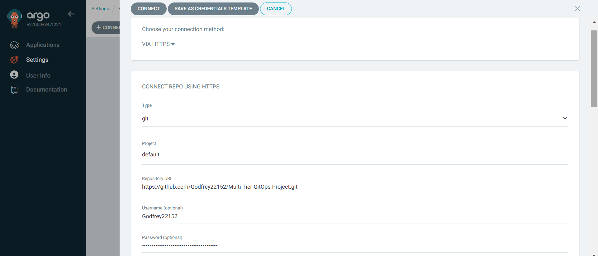

# CD: Application Deployment and Management with ArgoCD on the AWS EKS

This guide provides a detailed walkthrough for the `CD` setup and management using ArgoCD, configuring it to deploy the application using the `manifest` files on the branch in the already created AWS EKS cluster, and automating deployments with GitHub webhooks.

---

## Prerequisites

1. **AWS CLI**: Installed and configured with access to the EKS cluster.
2. **kubectl**: Installed and configured to access the cluster.
- **NOTE**: Kindly visit the **[Infra-Setup](https://github.com/Godfrey22152/Multi-Tier-GitOps-Project/blob/main/Infra-Setup/README.md)** folder in the `main branch` for a detailed guide on how to setup the EKS Cluster using `Terraform` and install `AWS CLI` and `kubectl`.

---

## Step 1: Accessing the EKS Cluster

To ensure your local machine can communicate with the EKS cluster:

```bash
aws eks --region <region> update-kubeconfig --name <cluster-name>

# In our case  
aws eks --region eu-west-1 update-kubeconfig --name odo-eks-cluster
```

Verify access with:
```bash
kubectl get nodes
```

---

## Step 2: Installing ArgoCD

1. **Create a Namespace for ArgoCD**:
   ```bash
   kubectl create namespace argocd
   ```

2. **Install ArgoCD**:
   ```bash
   kubectl apply -n argocd -f https://raw.githubusercontent.com/argoproj/argo-cd/stable/manifests/install.yaml 
   ```

3. **Verify Installation**:
   ```bash
   kubectl get pods -n argocd
   kubectl get services -n argocd
   ```

4. **Expose ArgoCD Server**:
   - For public access:
     ```bash
     kubectl patch svc argocd-server -n argocd -p '{"spec": {"type": {"LoadBalancer"}}'
     ```
   - For local clusters:
     ```bash
     kubectl port-forward svc/argocd-server -n argocd 8080:443
     ```

---

## Step 3: Accessing the ArgoCD UI

1. **Retrieve the External IP**:
   ```bash
   kubectl get svc -n argocd argocd-server
   ```
   Use the `<Loadbalancer-url>` to access the UI at `https://<argocd-Loadbalancer-url>`.

2. **Retrieve Initial Admin Credentials**:
   ```bash
   kubectl get secret argocd-initial-admin-secret -n argocd -o jsonpath="{.data.password}" | base64 -d
   ```
   - **Username**: `admin`
   - **Password**: Output of the above command.

3. **Change Admin Password**:
   - Navigate to **User Info** > **Update Password** in the ArgoCD UI to update the password.

---

## Step 4: Connecting Your Git Repository

1. In the ArgoCD UI:
   - Navigate to **Settings** > **Repositories**.
   - Click **Connect Repo** and provide:
     - **Choose your connection method**: `VIA HTTPS`
     - **Repository URL**: `https://github.com/Godfrey22152/Multi-Tier-GitOps-Project.git`
     - **Authentication**: Provide repository Username and Personal Access Token (PAT).

2. **Example UI Screenshot**:  
   Below is an example of the **Connect Repo** form in ArgoCD:

   
---

## Step 5: Creating an Application in ArgoCD

1. **Create a Namespace for the Application**:
   ```bash
   kubectl create namespace webapps
   ```

2. **Use the UI to Add the Application**:
   - Go to **Applications** > **New App** and fill out the form:
     - **APPLICATION NAME**: `bankapp`
     - **PROJECT NAME**: `default`
     - **SYNC POLICY**: Automated
     - **SYNC OPTIONS**:
       - **Skip Schema Validation**: Tick the box 
       - **Auto-Create Namespace**: Tick the box 
     - **SOURCE**:
       - **Repository URL**: `https://github.com/Godfrey22152/Multi-Tier-GitOps-Project.git`
       - **Revision**: `manifest`
       - **Path**: `.`
     - **DESTINATION**:
       - **Cluster**: `https://kubernetes.default.svc`
       - **Namespace**: `webapps`
     - **DIRECTORY**:
       - **Directory Recurse**: Tick the box.
   

3. **Save and Sync**:
   - Once configured, ArgoCD will fetch the repository, deploy the manifests, and monitor the application.

4. **Accessing the Application**:
   - In the ArgoCD UI, navigate to the **Applications** page.
   - Select the deployed application (`bankapp`) to open the details view.
   - On the application dashboard:
     - Verify that the **Sync Status** is `Synced` and the **Health Status** is `Healthy`.
   - Locate the **Resources** section, which lists all the Kubernetes objects created by the application.
     - Click on the **Service** resource (in our case, `bankapp-svc`) to open its details.
     - Look for the `<LOADBALANCER-URL>` under the **HOSTNAMES** section.
   - Open a browser and navigate to `http://<LOADBALANCER-URL>` to access the application.
     
---

## Step 6: Setting Up GitHub Webhooks for Automatic Sync

To ensure ArgoCD syncs automatically when changes are pushed to the repository:

1. **Enable Webhook in GitHub**:
   - Navigate to your repository settings on GitHub > **Webhooks** > **Add webhook**.
   - Payload URL : `https://<argocd-Loadbalancer-url>`
   - Content Type: `application/json`
   - Secret: (Optional, but recommended for security)
   - Disable SSL verification: (Disable SSL verification if your `ArgoCD server` has no SSL certificates)
   - Select Which events would you like to trigger this webhook: `Just the push event.`
   - Click `Add Webhooks` to save.

2. **Test Webhook**:
   - Push changes to your repository and verify if the application syncs in ArgoCD.

---

## Application Manifest Overview

Alternatively, here is the `yaml` manifest for the already configured `bankapp` application in `ArgoCD`:

```yaml
apiVersion: argoproj.io/v1alpha1
kind: Application
metadata:
  name: bankapp 
spec:
  destination:
    name: ''
    namespace: webapps
    server: https://kubernetes.default.svc
  source:
    path: .
    repoURL: https://github.com/Godfrey22152/Multi-Tier-GitOps-Project.git
    targetRevision: manifest
    directory:
      recurse: true
  project: default
  syncPolicy:
    automated:
      prune: true
      selfHeal: true
    syncOptions:
      - CreateNamespace=true
      - Validate=false
```

---

## Security Considerations

- **Admin Account**: Disable the default admin account once you have configured alternative user accounts or SSO.
- **Repository Authentication**: Use personal access tokens for secure repository access.
- **Webhooks**: Use a secret key to verify payload authenticity.

---

## Application Deployment Visuals

### Application Health in ArgoCD
This image shows the health status of the deployed application (`bankapp`) in ArgoCD UI, as `Processing` while waiting for `Loadbalancer-url` to be assigned to the `bankapp` service. This confirms that all deployed resources are both **Synced** and **Healthy** .


---

## Conclusion

We have successfully set up ArgoCD to manage the `CD` deployments on the EKS cluster. Hence, with GitOps and ArgoCD, we can ensure automated, reliable, and secure application delivery. 
- Moving on, kindly visit the **[Monitoring](https://github.com/Godfrey22152/Multi-Tier-GitOps-Project/blob/main/Monitoring/README.md)** folder in the `main` branch for a detailed guide on how to setup the `Monitoring tools` to monitor the application performance.

---
