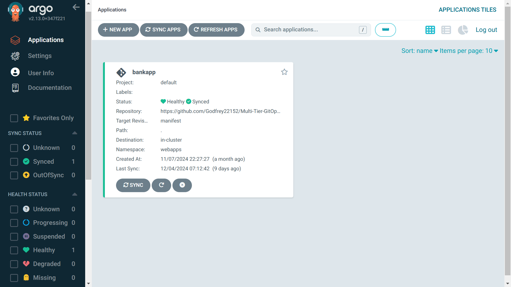

# Multi-Tier-GitOps-Project

### Table of Contents
- [Overview](#overview)
- [Features](#features)
- [Prerequisites](#prerequisites)
- [Technologies Used](#technologies-used)
- [Infrastructure Setup](#infrastructure-setup)
- [Screenshots](#screenshots)
- [References](#references)

## Overview

The **Multi-Tier-GitOps-Project** is a comprehensive GitOps-based CI/CD pipeline designed for deploying the **Bankapp** application in a Kubernetes cluster. This project integrates a secure, multi-stage deployment pipeline that encompasses:
- Continuous Integration (CI) via Jenkins, focusing on security and quality checks.
- Continuous Deployment (CD) using ArgoCD for automated and monitored releases.
- An extensive monitoring setup with Prometheus and Grafana to track application and infrastructure performance.

Each stage integrates security and quality checks, allowing the deployment pipeline to automatically respond to changes, detect potential vulnerabilities, and provide feedback on code quality. This guide outlines each stage and directs users to specific README files for detailed setup instructions.

## Features

### Continuous Integration (CI)
1. **Security Scanning**:
   - Filesystem and Docker images are scanned for vulnerabilities using [Trivy](https://aquasecurity.github.io/trivy/).
   
2. **Code Quality and Coverage**:
   - Code analysis is conducted through [SonarQube](https://www.sonarqube.org/) to identify code smells and measure test coverage.

3. **Artifact Management**:
   - Artifacts are stored and managed in [Nexus](https://www.sonatype.com/products/repository-oss).

4. **Automated Docker Tag Update**:
   - The `Deployment` manifest in the `manifest` branch is updated with the new Docker image tag.

5. **Notifications**:
   - Build outcomes are sent via email for real-time feedback on pipeline status.

6. **Additional CI Features**:
   - Workspace clearing to ensure a clean environment before every build.
   - Comprehensive testing and Maven-based compilation for code integrity.
   - Integration with Docker Hub for image storage and management.

### Continuous Deployment (CD)
1. **Automated Sync Policy**:
   - ArgoCD’s automated sync and webhook integration ensure that any changes to the deployment repository are immediately applied to the cluster.

2. **Self-Healing and Namespace Creation**:
   - Configured for self-healing and auto-creation of namespaces if they do not exist, ensuring a resilient deployment pipeline.

### Monitoring

1. **Prometheus Metrics**:
   - Prometheus scrapes both cluster-level metrics and custom application metrics to monitor the performance and health of the Bankapp application.
   - Custom metrics include the following, each helping to identify performance bottlenecks, optimize application response times, and improve user experience:

     - **`bankapp.dashboard`**: Tracks the time taken to load the dashboard for each user. Monitoring this helps identify delays in retrieving and displaying user data on the dashboard, allowing for optimization of this key interface.

     - **`bankapp.registerAccount`**: Measures the time taken to register a new account. By monitoring this, we ensure that user registration processes remain smooth and identify any delays that may deter new users from signing up.

     - **`bankapp.deposit`**: Tracks the duration to complete a deposit transaction. Monitoring this helps maintain transaction speed, ensuring a responsive user experience for deposits.

     - **`bankapp.withdraw`**: Monitors the time taken to process a withdrawal. Tracking this metric ensures that users experience minimal delays in accessing funds, which is critical for user trust and satisfaction.

     - **`bankapp.transactionHistory`**: Measures the time required to fetch a user's transaction history. This helps in ensuring quick access to transaction records, improving the user experience in financial management.

     - **`bankapp.transferAmount`**: Tracks the duration of fund transfers between accounts. Monitoring transfer times helps ensure efficient fund movement, vital for a seamless banking experience.

   - These custom metrics provide valuable insights into specific application functionalities and support proactive performance tuning, leading to a more reliable and responsive application.

2. **Grafana Dashboards**:
   - Visualization of real-time data and historical performance trends through custom Grafana dashboards.

## Prerequisites

Before setting up the Multi-Tier-GitOps-Project, ensure you have:
- A Kubernetes cluster (e.g., using Minikube, k3s, or a managed service like EKS/GKE/AKS).
- [Helm](https://helm.sh/) for deploying Prometheus and Grafana.
- [Jenkins](https://www.jenkins.io/) installed for managing the CI pipeline.
- [ArgoCD](https://argo-cd.readthedocs.io/en/stable/) installed in the cluster for CD.
- A Docker Hub account or private Docker registry for image storage.
- [SonarQube](https://www.sonarqube.org/) and [Nexus](https://www.sonatype.com/products/repository-oss) instances.

## Technologies Used

- **Kubernetes**: Orchestrates the containerized deployment of the Bankapp application.
- **Jenkins**: Implements CI by managing build, test, and deployment processes with security checks.
- **ArgoCD**: Automates continuous delivery with declarative GitOps for Kubernetes.
- **Prometheus**: Collects and manages metrics for the infrastructure and application.
- **Grafana**: Visualizes metrics and system health from Prometheus.
- **Trivy**: Scans the application code and Docker images for vulnerabilities.
- **SonarQube**: Analyzes code for quality, security vulnerabilities, and test coverage.
- **Nexus**: Stores and manages build artifacts.

## Infrastructure Setup

Each phase of this project has its own setup instructions. Please refer to the following folders in the repository for detailed setup guides:

1. **[Infra-Setup Folder in Main Branch](./Infra-Setup)**: Complete infrastructure setup.
2. **[Jenkins-CI Folder in Main Branch](./Jenkins-CI)**: CI pipeline setup with Jenkins.
3. **[Manifest Branch](https://github.com/Godfrey22152/Multi-Tier-GitOps-Project/tree/manifest)**: CD setup using ArgoCD.
4. **[Monitoring Folder in Main Branch](./Monitoring)**: Monitoring setup with Prometheus and Grafana.

## Screenshots

### The Bankapp Application
- **The Deployed Bankapp UI**
  
  
### Jenkins Pipeline Stages
- **Pipeline Stages and Successful Build**
  
  

- **Pipeline Build Notifications**
  
  

### ArgoCD Sync and Application Health Status
- **ArgoCD Sync Status**
  
- **Application Health Status**
  
  
  

### Prometheus Dashboard with Custom Metrics
- **Prometheus Cluster Metrics**
  
  
  
  
  
  
  
  
  

- **Custom Application Metrics**
  
  
  
   

### Grafana Dashboards Displaying Application Metrics
- **Grafana Application Performance Metrics**
  
- **Historical Trends**
  

## References

For more in-depth documentation on the tools and technologies used, please refer to:
- [Kubernetes Documentation](https://kubernetes.io/docs/home/)
- [Jenkins Documentation](https://www.jenkins.io/doc/)
- [ArgoCD Documentation](https://argo-cd.readthedocs.io/en/stable/)
- [Prometheus Documentation](https://prometheus.io/docs/introduction/overview/)
- [Grafana Documentation](https://grafana.com/docs/)
- [Trivy Documentation](https://aquasecurity.github.io/trivy/)
- [SonarQube Documentation](https://docs.sonarqube.org/)
- [Nexus Repository Documentation](https://help.sonatype.com/repomanager3)

---
