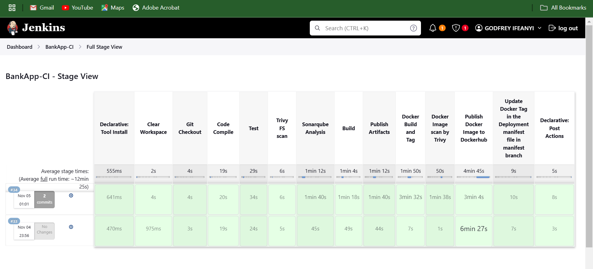
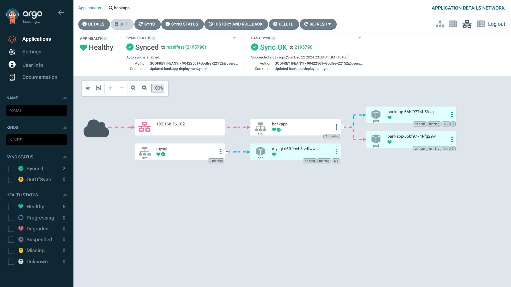
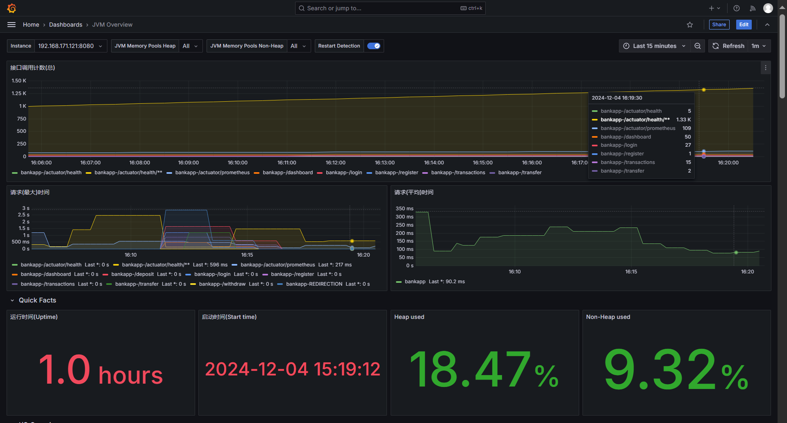
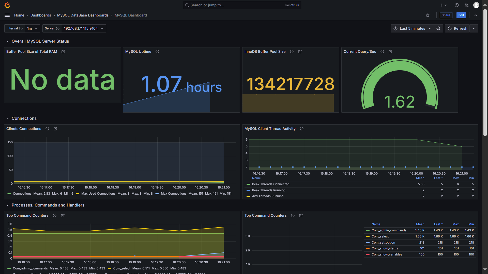

# Multi-Tier-GitOps-Project

### Table of Contents
- [Overview](#overview)
- [Features](#features)
- [Prerequisites](#prerequisites)
- [Technologies Used](#technologies-used)
- [Infrastructure Setup](#infrastructure-setup)
- [Screenshots](#screenshots)
- [References](#references)

## Overview
 
## **Multi-Tier-GitOps-Project workflow - `Bankapp` Application**  
   

The **Multi-Tier-GitOps-Project** is a comprehensive GitOps-based CI/CD pipeline designed for deploying the **Bankapp** application in a Kubernetes cluster. This project integrates a secure, multi-stage deployment pipeline that encompasses:
- Continuous Integration (CI) via Jenkins, focusing on security and quality checks.
- Continuous Deployment (CD) using ArgoCD for automated and monitored releases.
- An extensive monitoring setup with Prometheus and Grafana to track application and infrastructure performance.

Each stage integrates security and quality checks, allowing the deployment pipeline to automatically respond to changes, detect potential vulnerabilities, and provide feedback on code quality. This guide outlines each stage and directs users to specific README files for detailed setup instructions.

---
## **Features**

### Continuous Integration (CI)
1. **Security Scanning**:
   - Filesystem and Docker images are scanned for vulnerabilities using [Trivy](https://aquasecurity.github.io/trivy/).
   
2. **Code Quality and Coverage**:
   - Code analysis is conducted through [SonarQube](https://www.sonarqube.org/) to identify code smells and measure test coverage.

3. **Artifact Management**:
   - Artifacts are stored and managed in [Nexus](https://www.sonatype.com/products/repository-oss).

4. **Automated Docker Tag Update**:
   - The `Deployment` manifest in the **[Manifest](https://github.com/Godfrey22152/Multi-Tier-GitOps-Project/tree/manifest)** branch is updated with the new Docker image tag.

5. **Notifications**:
   - Build outcomes are sent via email for real-time feedback on pipeline status.

6. **Additional CI Features**:
   - Workspace clearing to ensure a clean environment before every build.
   - Comprehensive testing and Maven-based compilation for code integrity.
   - Integration with Docker Hub for image storage and management.

### [Continuous Deployment-(CD)](https://github.com/Godfrey22152/Multi-Tier-GitOps-Project/tree/manifest)
1. **Automated Sync Policy**:
   - ArgoCD’s automated sync and webhook integration ensure that any changes to the deployment repository are immediately applied to the cluster.

2. **Self-Healing and Namespace Creation**:
   - Configured for self-healing and auto-creation of namespaces if they do not exist, ensuring a resilient deployment pipeline.

### Monitoring

#### 1. **[Prometheus Metrics](./Monitoring/README.md)**
   - Prometheus scrapes both cluster-level metrics and custom application metrics to monitor the performance and health of the Bankapp application.
   - Custom metrics include the following, each helping to identify performance bottlenecks, optimize application response times, and improve user experience:

     - **`bankapp.dashboard`**: Tracks the time taken to load the dashboard for each user. Monitoring this helps identify delays in retrieving and displaying user data on the dashboard, allowing for optimization of this key interface.

     - **`bankapp.registerAccount`**: Measures the time taken to register a new account. By monitoring this, we ensure that user registration processes remain smooth and identify any delays that may deter new users from signing up.

     - **`bankapp.deposit`**: Tracks the duration to complete a deposit transaction. Monitoring this helps maintain transaction speed, ensuring a responsive user experience for deposits.

     - **`bankapp.withdraw`**: Monitors the time taken to process a withdrawal. Tracking this metric ensures that users experience minimal delays in accessing funds, which is critical for user trust and satisfaction.

     - **`bankapp.transactionHistory`**: Measures the time required to fetch a user's transaction history. This helps in ensuring quick access to transaction records, improving the user experience in financial management.

     - **`bankapp.transferAmount`**: Tracks the duration of fund transfers between accounts. Monitoring transfer times helps ensure efficient fund movement, vital for a seamless banking experience.

   - These custom metrics provide valuable insights into specific application functionalities and support proactive performance tuning, leading to a more reliable and responsive application.

#### 2. **[AlertManager](./Monitoring/Alertmanager-setup)**

The AlertManager configuration in this project enhances the monitoring and notification system by effectively managing alerts generated by Prometheus. Below are the key features of the AlertManager setup:

##### 1. **Custom Prometheus Alerting Rules**
The integration includes finely tuned alerting rules for both application-specific and cluster-wide metrics:
- **Application Alerts**: Detect critical issues such as `MySQLInstanceDown` and `BankAppInstanceDown`.
- **Performance Alerts**: Monitor thresholds like `HighDashboardLoadTime` and `HighDepositLatency` to ensure application responsiveness.
- **Cluster Health Alerts**: Track resource usage with alerts such as `NodeMemoryUsageHigh` and `DiskSpaceLow` to maintain cluster stability.

##### 2. **Dynamic Notification Routing**
AlertManager routes alerts to relevant teams and channels based on specific labels, ensuring prompt and accurate notifications:
- **Team-Based Routing**: Alerts are routed to `infra-team` or `devops-team` depending on severity and context.
- **Multi-Channel Support**: Configured to send notifications via **email** and **Slack** for broad accessibility.
- **Inhibition Rules**: Prevents redundant alerts by suppressing dependent alerts, such as `BankAppInstanceDown` when `MySQLInstanceDown` is already active.

##### 3. **Efficient Alert Handling**
Optimized configuration reduces alert fatigue and ensures actionable notifications:
- **Alert Grouping**: Alerts are batched and sent every 5 minutes (`group_interval`) to avoid overwhelming teams.
- **Repeat Alerts**: Critical unresolved alerts are repeated every 3 hours to maintain visibility.
- **Resolved Alert Notifications**: Notifications are sent for resolved issues (`send_resolved: true`), closing the loop on incident tracking.

##### 4. **Real-World Scenario Testing**
The setup has been tested with real-world scenarios to validate its robustness:
- Simulated failures like pods in a `CrashLoopBackOff` state to trigger alerts and verify notifications.
- Tested **inhibition rules** to ensure dependent alerts are effectively suppressed, focusing on root causes.

##### 5. **Flexible and Scalable Configuration**
The AlertManager configuration supports:
- **Dynamic Placeholders**: Alerts include detailed annotations (`summary` and `description`) for actionable insights.
- **Easily Extendable**: The YAML-based configuration can be modified to add new teams, notification channels, or routing rules as the system grows.

The AlertManager configuration ensures comprehensive monitoring, efficient incident management, and effective team communication, making it a cornerstone of the monitoring stack for this project.

#### 3. **[Grafana Visualization](./Monitoring/Grafana-setup)**

The Grafana setup in this project enables powerful visualization and monitoring of metrics collected by Prometheus. Below are the key features:

##### 1. **Custom Dashboards**
- Includes pre-configured dashboards for **MySQL metrics**, **Node metrics**, **JVM metrics**, and more.
- Custom dashboards like **Pod Stats** provide insights into pod-level performance metrics.

##### 2. **Integration with Prometheus**
- Prometheus is configured as the primary data source for Grafana.
- Queries and visualizations are powered by PromQL, ensuring accurate representation of metrics.

##### 3. **Real-Time Monitoring**
- Dashboards provide live updates on metrics, helping to quickly identify and troubleshoot issues.
- Historical data is accessible for trend analysis and capacity planning.

##### 4. **Flexible Customization**
- Dashboards and panels can be easily tailored or extended to accommodate additional metrics.
- Supports advanced visualizations like time-series graphs, pie charts, and stat panels.

##### 5. **Efficient Organization**
- Dashboards are grouped into meaningful folders (e.g., **BankApp Metrics**, **MySQL Database Dashboards**, **Pods by Namespace**) for easy navigation.
- Provides a structured approach to managing multiple dashboards in complex environments.

This Grafana setup enhances observability, enabling teams to maintain high performance and reliability for both the application and the underlying infrastructure.

---
## Prerequisites

Before setting up the Multi-Tier-GitOps-Project, you need a good knowledge of the following and have them installed in your cluster:
- A Kubernetes cluster (e.g., using Minikube, k3s, or a managed service like EKS/GKE/AKS).
- [Helm](https://helm.sh/) for deploying Prometheus and Grafana.
- [Jenkins](https://www.jenkins.io/) installed for managing the CI pipeline.
- [ArgoCD](https://argo-cd.readthedocs.io/en/stable/) installed in the cluster for CD.
- A Docker Hub account or private Docker registry for image storage.
- [SonarQube](https://www.sonarqube.org/) and [Nexus](https://www.sonatype.com/products/repository-oss) instances.

---
## Technologies Used

- **Kubernetes**: Orchestrates the containerized deployment of the Bankapp application.
- **Jenkins**: Implements CI by managing build, test, and deployment processes with security checks.
- **ArgoCD**: Automates continuous delivery with declarative GitOps for Kubernetes.
- **Prometheus**: Collects and manages metrics for the infrastructure and application.
- **Grafana**: Visualizes metrics and system health from Prometheus.
- **AlertManager**: Enhances the monitoring and notification system by effectively managing alerts generated by Prometheus.
- **Trivy**: Scans the application code and Docker images for vulnerabilities.
- **SonarQube**: Analyzes code for quality, security vulnerabilities, and test coverage.
- **Nexus**: Stores and manages build artifacts.

---
## Infrastructure Setup

Each phase of this project has its own setup instructions. Please refer to the following folders in the repository for detailed setup guides:

1. **[Infra-Setup Folder in Main Branch](./Infra-Setup)**: Complete infrastructure setup.
2. **[Jenkins-CI Folder in Main Branch](./Jenkins-CI)**: CI pipeline setup with Jenkins.
3. **[Manifest Branch](https://github.com/Godfrey22152/Multi-Tier-GitOps-Project/tree/manifest)**: CD setup using ArgoCD.
4. **[Monitoring Folder in Main Branch](./Monitoring)**: Monitoring setup with Prometheus and Grafana.

---
## Screenshots

### The Bankapp Application
- **The Deployed Bankapp UI**
  
  
### Jenkins Pipeline Stages
- **Pipeline Stages and Successful Build**
  
  

- **Pipeline Build Notifications**
  
  

### ArgoCD Sync and Application Health Status
- **ArgoCD Sync Status**
  
- **Application Health Status**
  
  
  
  

### Prometheus Dashboard with Custom Metrics
- **Prometheus Cluster Metrics**
  
  
  
  
  
  
  
  
  

- **Custom Application Metrics**
  
  
  
   

### Grafana Dashboards Displaying Application Metrics

#### 1. Application Performance Metrics
  
  - **JVM Overview Dashboard for Monitoring the `Bankapp` Custom Metrics**  
     
     
     
          

#### 2 MySQL Database Dashboards

  - **MySQL Overview Dashboards for Monitoring the `MySQL` database Metrics**  
     
     

---
## References

For more in-depth documentation on the tools and technologies used, please refer to:
- [Kubernetes Documentation](https://kubernetes.io/docs/home/)
- [Jenkins Documentation](https://www.jenkins.io/doc/)
- [ArgoCD Documentation](https://argo-cd.readthedocs.io/en/stable/)
- [Prometheus Documentation](https://prometheus.io/docs/introduction/overview/)
- [Grafana Documentation](https://grafana.com/docs/)
- [Trivy Documentation](https://aquasecurity.github.io/trivy/)
- [SonarQube Documentation](https://docs.sonarqube.org/)
- [Nexus Repository Documentation](https://help.sonatype.com/repomanager3)

---
